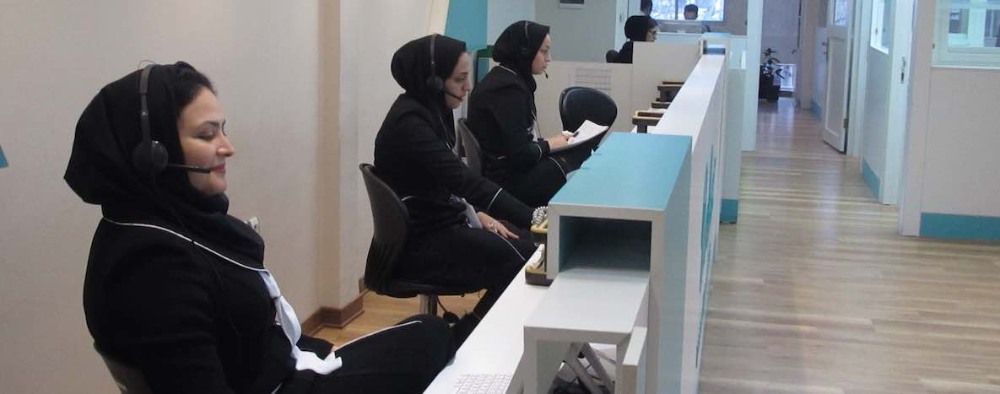
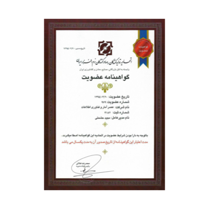
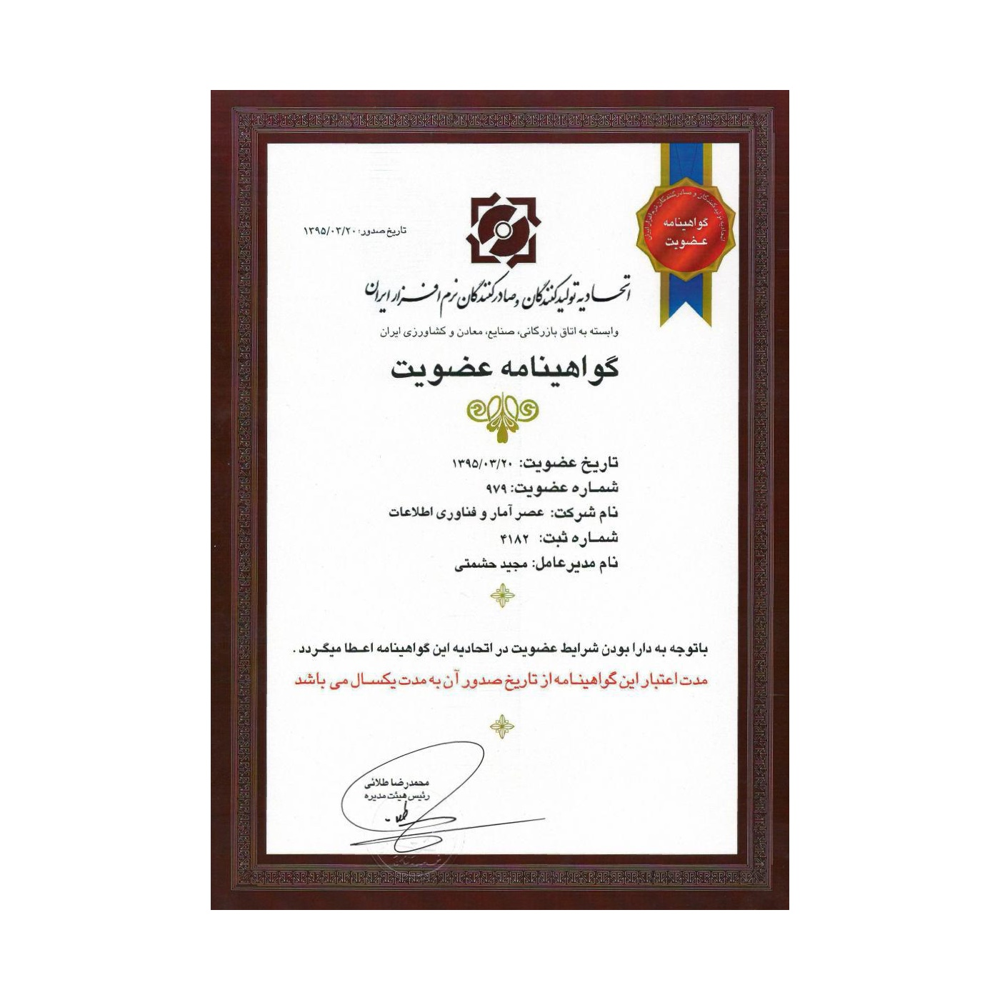

شرکت عصر آمار و فناوری اطلاعات با نام تجاری پارس فایبرنت، در سال ۱۳۸۳ فعالیت خود را آغاز کرد. در ابتدای راه، فعالیت‌های اصلی این شرکت بر ارائه خدمات بازاریابی، واردات، فروش و پشتیبانی تخصصی تجهیزات شبکه متمرکز بود. در ادامه، پارس فایبرنت خدمات خود را به ارائه راهکارهای نرم‌افزاری در بخش‌های اداری، مالی و بازرگانی، توسعه نرم‌افزارهای تلفن همراه، خدمات پشتیبانی نرم‌افزار ‌و ارائه مشاوره، طراحی و اجرای پروژه‌های مهندسی شبکه و امنیت اطلاعات گسترش داد. در این راه با بهره بردن از نیروهای متخصص و به‌کارگیری ایده‌های نو، توانست برای کسب و کارهای مختلف فرصت‌های جدیدی ایجاد کند.

در سال ۱۳۹۴ شرکت پارس فایبرنت با رویکرد گسترش خدمات فنی و تخصصی در حوزه IT و ICT، به راه‌اندازی مرکز تماس اقدام کرد. هدف این شرکت، ارائه خدمات فنی، بازاریابی، فروش و پشتیبانی به کسب و کارها است.
تنوع محصولات و خدمات، احترام به مشتریان، بهره‌گیری مناسب از فناوری و به کارگیری نیروهای متخصص و باتجربه، شرکت پارس فایبرنت را به یکی از معتبرترین شرکت‌های ارائه‌دهنده خدمات IT و ICT بدل کرده است. اکنون با بیش از یک دهه فعالیت حرفه‌ای، پارس فایبرنت خدمات متنوع خود را به سازمان‌ها و شرکت‌ها ارائه می‌کند.

    

        
        <small>مجوز مرکز تماس (Contact Center)</small>
    

    

        
        <small>عضویت در اتحادیه تولیدکنندگان و صادر کنندگان نرم‌افزار ایران</small>
    

    

        
        <small>عضو سازمان صنفی رایانه‌ای استان تهران</small>
    

  
  <button class="close-button" data-close aria-label="Close reveal" type="button">
    &times;
  </button>

  
  <button class="close-button" data-close aria-label="Close reveal" type="button">
    &times;
  </button>

  
  <button class="close-button" data-close aria-label="Close reveal" type="button">
    &times;
  </button>

