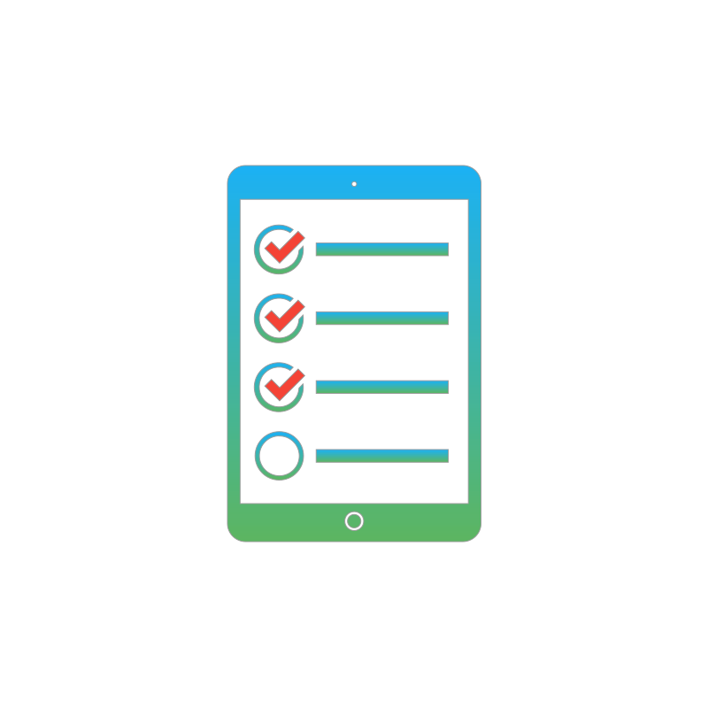

    
به‌منظور تعامل بهتر با مشتریان، شرکت پارس فایبرنت مرکز تماس خود را با نیروهایی باتجربه و کارآزموده راه‌اندازی کرد. در سال ۱۳۹۴ این مرکز پاسخگویی تلفنی سامانه ۲۰۲۰ شرکت مخابرات استان گلستان را برعهده داشت و طی یکسال، خدمات فروش و پشتیبانی را به مشتریان مخابرات این استان ارائه نمود. شرکت پارس فایبرنت درسال ۱۳۹۵ به عنوان سومین شرکت در کشور، موفق به اخذ مجوز ارائه خدمات مرکز تماس (<strong>Contact Center</strong>) از سازمان تنظیم مقررات و ارتباطات رادیویی شد.

    

        
        <h3 class="feature-block-header">شماره اختصاصی</h3>
        
شماره‌های تماس ۴ و ۵ رقمی به کسب و کار شما اختصاص می‌دهیم تا ارتباط آسان‌تری با مشتریان داشته باشید.

    

    

        
        <h3 class="feature-block-header">بازاریابی و فروش</h3>
        
با راهکارهای متفاوت فروش و بازاریابی از راه تلفن، وب، اپلیکیشن و کد USSD به گسترش کسب و کار شما کمک می‌کنیم.

    

    

        
        <h3 class="feature-block-header">پشتیبانی ۲۴ ساعته</h3>
        
از راه تلفن، پیامک، ایمیل و سیستم تیکت آنلاین و نیز با اعزام کارشناسان فنی، پشتیبان مشتریان شما هستیم.

    

    

        
        <h3 class="feature-block-header">منشی مجازی</h3>
        
با ارائه‌ی شماره‌ای اختصاصی، دفتری مجازی در اختیار شما می‌گذاریم تا زمان و قرارهای خود را مدیریت کنید.

    

    

        
        <h3 class="feature-block-header">صدای مشتری</h3>
        
انتقادات،‌ پیشنهادات و سؤالات مشتریان و کاربران را به گوش شما می‌رسانیم تا مشتری‌محورانه تصمیم بگیرید.

    

    

        
        <h3 class="feature-block-header">نظرسنجی</h3>
        
به‌منظور شناخت نیازها، بازار هدف و دریافت بازخورد، نظر کاربران و مشتریان کسب و کار شما را جویا می‌شویم.

    

  

    

        

            

                

                    
                

                

                    <h2 class="large-feature-header">خدمات موبایل</h2>
                    <!-- <h4 class="subheader">لورم ایپسوم متن ساختگی با تولید سادگی</h4> -->
                    
همگام با توسعه تجارت الکترونیک و رشد استفاده از عامل‌های نرم‌افزاری در ارائه خدمات به مشتریان، مرکز تماس پارس فایبرنت علاوه بر پاسخگویی تلفنی و روش‌های سنتی همچون فکس و ایمیل، از اپلیکیشن‌های تلفن همراه، پیام‌رسان‌ها و کد USSD برای ارائه‌ خدمات حضوری/غیرحضوری آنلاین و آفلاین بهره می‌برد.

                

            

        

        

            

                

                    
                

                

                    <h2 class="large-feature-header">مدیریت ارتباط با مشتریان</h2>
                    <!-- <h4 class="subheader">فراوان جامعه و متخصصان را می طلبد تا با نرم افزارها شناخت</h4> -->
                    
با هدف بهینه‌سازی تعامل با مشتریان و فرآیندها، کارشناسان نرم‌افزار پارس فایبرنت نرم‌افزارهای مدیریت ارتباط با مشتری (CRM) و سیستم‌های اطلاعات مدیریت (IMS) را توسعه داده‌اند. این نرم‌افزارها، موجب بهبود عمکرد کارکنان و افزایش بهره‌وری مرکز تماس این شرکت می‌شود.

                

            

        

        

            

                

                    
                

                

                    <h2 class="large-feature-header">مانیتورینگ</h2>
                    <!-- <h4 class="subheader">متخصصان را می طلبد تا با نرم افزارها شناخت</h4> -->
                    
بهره‌وری و برخورداری از مرکز تماسی منطبق با استانداردهای بین‌المللی از اهداف اصلی پارس فایبرنت است. بدین منظور، تیم‌های ارزیابی و کنترل کیفی، شرایطی را برای مانیتور کردن خدمات مرکز تماس از جمله عملکرد اپراتورها، نیاز کاربران، ترافیک تماس‌ها، درصد تماس‌های موفق و ناموفق و میزان رضایت مشتریان فراهم نمود‌اند.

                

            

        

    

